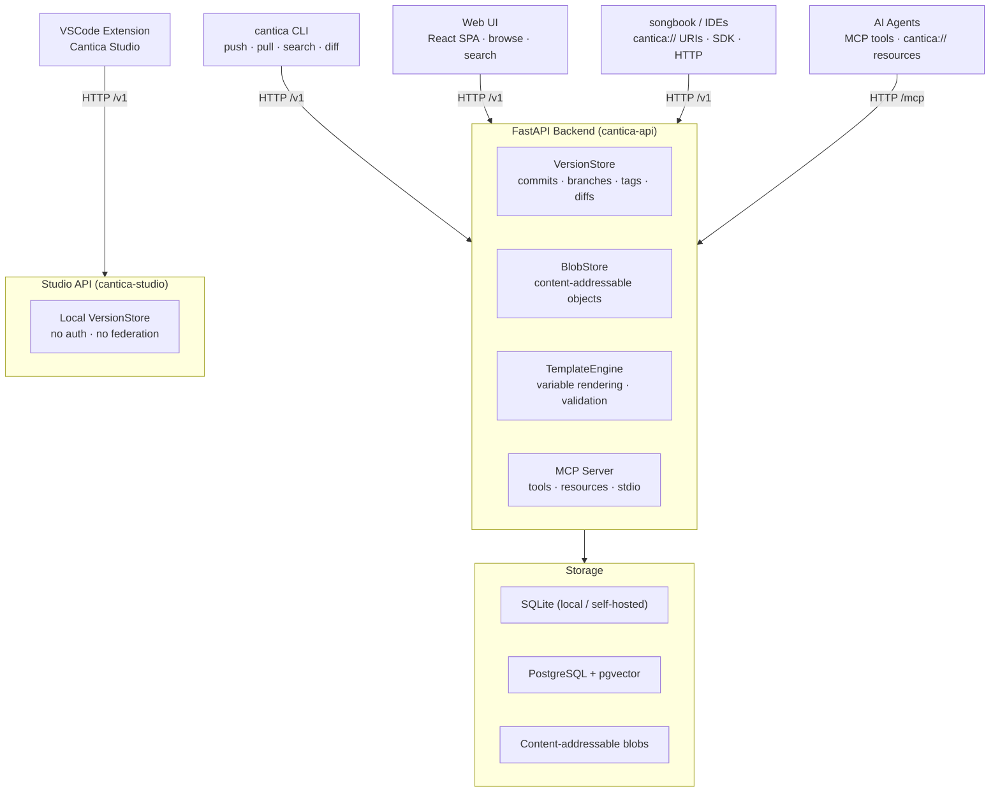

# Cantica

> *Cantica (Latin: canticum, pl. cantica — song, hymn, chant)*
>
> Prompts are incantations: words composed with care to summon a specific
> performance from an AI. A cantica is a sacred chant — functional, precise,
> and crafted to produce a response.

**Cantica is a git-flavored registry for AI prompts** — part personal vault,
part community hub, part package manager.

Like npm for Node modules or PyPI for Python packages, but for prompts:

- Every prompt is **versioned, diffable, and forkable**
- Namespaced by user or organization (`osteck/code-reviewer@v2.1`)
- Addressable by URI (`cantica://osteck/code-reviewer@v2.1`)
- Self-hostable locally or consumable from a cloud instance
- Searchable by text, tags, and model compatibility

---

## Monorepo structure

```
cantica/
├── cantica-api/        # FastAPI backend + CLI + MCP server (Python / uv)
├── cantica-web/        # React SPA (Vite + TypeScript + Tailwind)
├── cantica-studio/     # VSCode extension + lightweight local API
└── docs/               # Architecture notes and roadmap
```

| Sub-project | Repo | Description |
|---|---|---|
| [`cantica-api`](https://github.com/oliben67/cantica-api) | Python API | FastAPI server, CLI, MCP server, VersionStore, BlobStore |
| [`cantica-web`](https://github.com/oliben67/cantica-web) | React SPA | Browse, search, and manage prompts in the browser |
| [`cantica-studio`](https://github.com/oliben67/cantica-studio) | VSCode extension | In-editor prompt browsing, editing, and rendering |

---

## Architecture



### Key concepts

| Concept | Description |
|---|---|
| **Prompt** | A rich artifact: name, namespace, tags, variables, content, license |
| **Version** | Every save is a commit with message, author, SHA, and parent |
| **Namespace** | User or org prefix — mirrors GitHub's `owner/repo` model |
| **Collection** | A curated, versioned set of related prompts |
| **Fork** | Copy a prompt with full lineage tracked; pull upstream changes |

---

## Prerequisites

| Tool | Version | Purpose |
|---|---|---|
| [Python](https://python.org) | ≥ 3.14 | API runtime |
| [uv](https://docs.astral.sh/uv/) | latest | Python package manager |
| [Node.js](https://nodejs.org) | ≥ 20 | Frontend toolchain |
| [Task](https://taskfile.dev) | ≥ 3.28 | Task runner |
| [Atlas](https://atlasgo.io) | latest | Database migrations |

---

## Quick start

```bash
# 1. Clone with submodules
git clone --recurse-submodules git@github.com:oliben67/cantica.git
cd cantica

# 2. Install all dependencies
task api:install      # Python deps (uv)
task ui:install       # npm deps

# 3. Start the full development environment
task dev              # API + frontend concurrently
```

The API is available at `http://localhost:8042` and the frontend dev server
at `http://localhost:5173` (proxying `/v1` to the API).

---

## Available tasks

Run `task` at the repo root to list all tasks. The root orchestrates both
sub-projects; sub-project tasks are namespaced `api:*` and `ui:*`.

### Root tasks

| Task | Description |
|---|---|
| `task dev` | Start API + frontend concurrently |
| `task check` | Run all quality gates (API + frontend) |
| `task fix` | Auto-fix lint across API + frontend |
| `task ci` | Full CI pipeline for all sub-projects |
| `task clean` | Remove build artefacts across all sub-projects |
| `task clean:all` | Deep clean including venv and node_modules |

### API tasks (`api:*`)

| Task | Description |
|---|---|
| `task api:install` | Sync Python deps with uv |
| `task api:test` | Full test suite with coverage (≥ 99 %) |
| `task api:test:fast` | Tests without coverage |
| `task api:lint` | Ruff lint check |
| `task api:format` | Ruff format |
| `task api:typecheck` | Mypy type check |
| `task api:serve` | Dev server with auto-reload |
| `task api:db:new -- <name>` | Plan a new migration |
| `task api:db:apply -- <url>` | Apply pending migrations |

### Frontend tasks (`ui:*`)

| Task | Description |
|---|---|
| `task ui:install` | Install npm dependencies |
| `task ui:dev` | Start Vite dev server |
| `task ui:build` | Production build |
| `task ui:lint` | ESLint |
| `task ui:preview` | Preview production build |

---

## Configuration

The API is configured via environment variables (prefix `CANTICA_`):

| Variable | Default | Description |
|---|---|---|
| `CANTICA_VAULT_PATH` | `./vault` | Path to the prompt vault directory |
| `CANTICA_PORT` | `8042` | API server port |
| `CANTICA_AUTH_ENABLED` | `false` | Enable bearer-token authentication |
| `CANTICA_MCP_API_KEY` | — | API key used by the MCP server's `commit_prompt` tool when auth is enabled |
| `CANTICA_REMOTE_URL` | — | Remote Cantica instance to federate with |

---

## Development

```bash
# Run the full check suite
task check

# Auto-fix lint + format issues
task fix

# API only: run a single test
task api:test:one -- branch

# Update Python dependencies
task api:deps:update

# Plan a new database migration after model changes
task api:db:new -- add_tags_index
```

---

## Docs

- [ROADMAP.md](docs/ROADMAP.md) — vision, core concepts, and planned milestones
- [auth-tokens-api-key-vs-jwt.md](docs/auth-tokens-api-key-vs-jwt.md) — auth design decision
- [blob-store-custom-vs-git-libraries.md](docs/blob-store-custom-vs-git-libraries.md) — storage design decision
- [API schema](docs/prompt-metadata-schema.json) — JSON schema for prompt metadata

---

## License

MIT — see individual sub-project READMEs for details.
