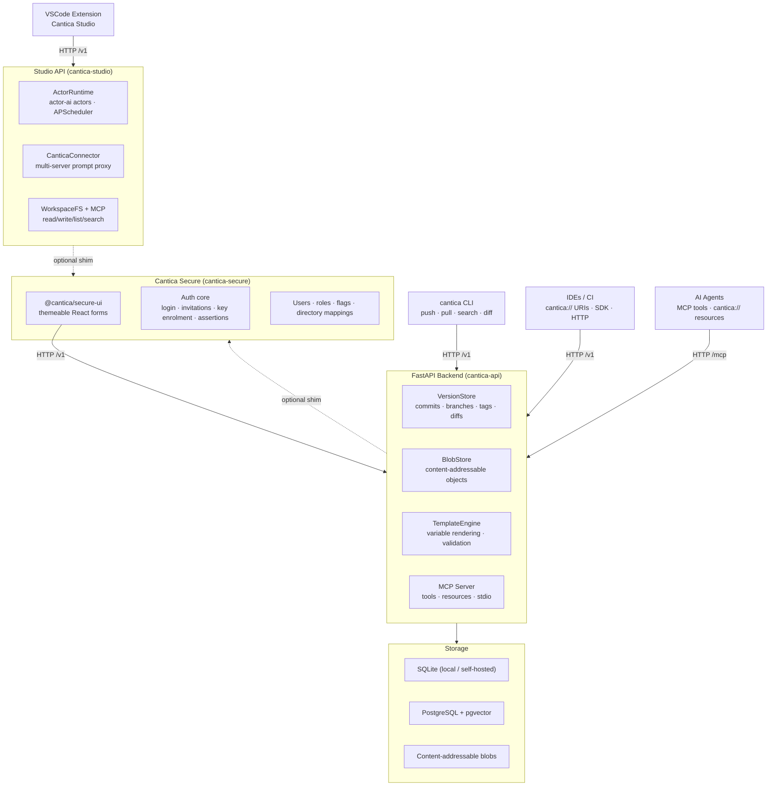

# Cantica

> *Cantica (Latin: canticum, pl. cantica — song, hymn, chant)*
>
> Prompts are incantations: words composed with care to summon a specific
> performance from an AI. A cantica is a sacred chant — functional, precise,
> and crafted to produce a response.

**Cantica is a git-flavored registry for AI prompts** — part personal vault,
part community hub, part package manager.

Like npm for Node modules or PyPI for Python packages, but for prompts:

- Every prompt is **versioned, diffable, and forkable**
- Namespaced by user or organization (`osteck/code-reviewer@v2.1`)
- Addressable by URI (`cantica://osteck/code-reviewer@v2.1`)
- Self-hostable locally or consumable from a cloud instance
- Searchable by text, tags, and model compatibility

---

## Monorepo structure

The repository is a set of git submodules orchestrated from the root Taskfile.

```
cantica/
├── actor-ai/           # Multi-provider AI actor framework (Python / uv)
├── cantica-api/        # FastAPI backend + CLI + MCP server (Python / uv)
├── cantica-web/        # React SPA (Vite + TypeScript + Tailwind)
├── cantica-studio/     # VSCode extension + Electron app + Studio API
├── cantica-secure/     # Shared security package: FastAPI shim + React forms
└── docs/               # Architecture notes, specs, and roadmaps
```

| Sub-project | Repo | Description |
|---|---|---|
| [`actor-ai`](https://github.com/oliben67/actor-ai) | Python library | Multi-provider AI actor framework (Claude, GPT, Gemini, Mistral, Copilot) used by the Studio API |
| [`cantica-api`](https://github.com/oliben67/cantica-api) | Python API | FastAPI server, CLI, MCP server, VersionStore, BlobStore |
| [`cantica-web`](https://github.com/oliben67/cantica-web) | React SPA | Browse, search, and manage prompts in the browser |
| [`cantica-studio`](https://github.com/oliben67/cantica-studio) | VSCode extension + Electron app | In-editor actor graphs, prompt browsing/editing, and the Studio API server |
| [`cantica-secure`](https://github.com/oliben67/cantica-secure) | Python + npm package | Shimmable auth/authorization core and themeable React forms shared by both servers |

---

## Architecture



### Key concepts

| Concept | Description |
|---|---|
| **Prompt** | A rich artifact: name, namespace, tags, variables, content, license |
| **Version** | Every save is a commit with message, author, SHA, and parent |
| **Namespace** | User or org prefix — mirrors GitHub's `owner/repo` model |
| **Collection** | A curated, versioned set of related prompts |
| **Fork** | Copy a prompt with full lineage tracked; pull upstream changes |

---

## Prerequisites

| Tool | Version | Purpose |
|---|---|---|
| [Python](https://python.org) | ≥ 3.14 | API runtime |
| [uv](https://docs.astral.sh/uv/) | latest | Python package manager |
| [Node.js](https://nodejs.org) | ≥ 20 | Frontend / VSCode / Electron toolchain |
| [Docker](https://docker.com) | latest | Compose stack + Studio API container |
| [Task](https://taskfile.dev) | ≥ 3.28 | Task runner |
| [Atlas](https://atlasgo.io) | latest | Database migrations |

---

## Quick start

```bash
# 1. Clone with submodules
git clone --recurse-submodules git@github.com:oliben67/cantica.git
cd cantica

# 2. Install everything (Python + npm across all sub-projects)
task install          # or per project: task api:install, task web:install, …

# 3. Start the full development environment
task dev              # API + frontend concurrently
```

The API is available at `http://localhost:8042` and the frontend dev server
at `http://localhost:5173` (proxying `/v1` to the API).

---

## Available tasks

Run `task` at the repo root to list everything. Each sub-project is included
under its own namespace — `actor:*`, `api:*`, `web:*`, `studio:*`, `secure:*` —
and every one exposes the same **canonical verbs**, so the root aggregates fan
out uniformly.

### Canonical verbs (every sub-project)

| Verb | Description |
|---|---|
| `install` | Install dependencies |
| `test` | Run the test suite (Python suites enforce ≥ 99 % coverage) |
| `build` | Build the artefact (wheel / bundle / extension / library) |
| `check` | All quality gates (lint · format · typecheck · test, where applicable) |
| `ci` | Frozen-install CI pipeline |
| `clean` / `clean:all` | Remove artefacts / also remove venv + node_modules |

Example: `task api:test`, `task web:build`, `task secure:check`,
`task studio:test`.

### Root aggregates

| Task | Description |
|---|---|
| `task install` | Install every sub-project |
| `task test` | Run every sub-project's tests |
| `task check` | Run every sub-project's quality gates |
| `task fix` | Auto-fix lint + format across projects that support it |
| `task ci` | Full CI pipeline for all sub-projects |
| `task dev` | Start API + frontend concurrently |
| `task clean` / `task clean:all` | Clean all sub-projects |

### Docker orchestration (root)

| Task | Description |
|---|---|
| `task up` / `task down` | Start / stop the Compose stack (postgres · api · web) |
| `task build` | Build all Docker images (⚠ this is Compose image build, not sub-project builds) |
| `task rebuild` | No-cache image rebuild + restart |
| `task logs` / `task ps` | Follow logs / show container status |

### Notable per-project tasks

| Task | Description |
|---|---|
| `task api:serve` | Cantica API dev server with auto-reload |
| `task api:db:new -- <name>` | Plan a new Atlas migration |
| `task web:dev` | Start the Vite dev server |
| `task studio:app` | Build and launch the Cantica Studio Electron app |
| `task studio:vscode:install:vsix` | Package + install the VSCode extension |
| `task secure:wheel:publish` | Build the cantica-secure wheel to the repo root (for Docker) |
| `task secure:contract:freeze` | Re-freeze the security API contract |

---

## Configuration

The API is configured via environment variables (prefix `CANTICA_`):

| Variable | Default | Description |
|---|---|---|
| `CANTICA_VAULT_PATH` | `./vault` | Path to the prompt vault directory |
| `CANTICA_PORT` | `8042` | API server port |
| `CANTICA_AUTH_ENABLED` | `false` | Enable bearer-token authentication |
| `CANTICA_MCP_API_KEY` | — | API key used by the MCP server's `commit_prompt` tool when auth is enabled |
| `CANTICA_REMOTE_URL` | — | Remote Cantica instance to federate with |
| `CANTICA_SECURITY_SHIM` | `false` | Serve auth via the shared **Cantica Secure** shim (see below) |

The Studio API is configured with the `STUDIO_` prefix (`STUDIO_LOCAL_MODE`,
`STUDIO_SECURITY_SHIM`, `STUDIO_JWT_SECRET`, LDAP/OIDC settings, …).

---

## Security & multi-user (remote mode)

Both servers run **single-user by default** (`local_mode` — auth disabled, one
synthetic admin). Setting them to **remote mode** unlocks invitation-based
multi-user access:

- **Registration by invitation** — enterprise (LDAP / OIDC directory
  provisioning with group→role mapping) or self-service, with an admin
  activation step for new (`newbie`) accounts.
- **Key-based authentication** — clients enrol an RSA key pair; a key-signed
  assertion is exchanged for a short-lived session token. Private keys never
  leave the client.
- **Roles, permissions, and moderation flags** — a per-request gate so a
  `blocked` flag or deactivation invalidates live tokens immediately;
  `warning` flags surface via the `X-Cantica-Warning` header.

This logic lives once in **[`cantica-secure`](cantica-secure/)** — a shimmable
FastAPI package plus a themeable React form library (`@cantica/secure-ui`) —
and both servers mount it behind the `*_SECURITY_SHIM` flag. cantica-web serves
the admin screens at `/admin/security`; the Studio clients expose them behind
the toolbar **Security** entry. See
[docs/roadmap-cantica-secure.md](docs/roadmap-cantica-secure.md) for the
extraction design and status.

---

## Development

```bash
# Run the full check suite
task check

# Auto-fix lint + format issues
task fix

# API only: run a single test
task api:test:one -- branch

# Update Python dependencies
task api:deps:update

# Plan a new database migration after model changes
task api:db:new -- add_tags_index
```

---

## Docs

**Vision & design**
- [ROADMAP.md](docs/ROADMAP.md) — vision, core concepts, and planned milestones
- [auth-tokens-api-key-vs-jwt.md](docs/auth-tokens-api-key-vs-jwt.md) — auth design decision
- [blob-store-custom-vs-git-libraries.md](docs/blob-store-custom-vs-git-libraries.md) — storage design decision
- [API schema](docs/prompt-metadata-schema.json) — JSON schema for prompt metadata

**Security & multi-user**
- [remote-mode-registration-auth.md](docs/remote-mode-registration-auth.md) — the registration/authentication spec
- [roadmap-remote-mode-auth.md](docs/roadmap-remote-mode-auth.md) — in-server remote-mode implementation plan
- [roadmap-cantica-secure.md](docs/roadmap-cantica-secure.md) — extracting the shared `cantica-secure` package (phases A–F)

**Studio**
- [roadmap-setup-provider-modals.md](docs/roadmap-setup-provider-modals.md) — in-webview setup / provider-key forms
- [actor-event-cron-regressions.md](docs/actor-event-cron-regressions.md) — Studio actor/event/cron regression notes

---

## License

MIT — see individual sub-project READMEs for details.
